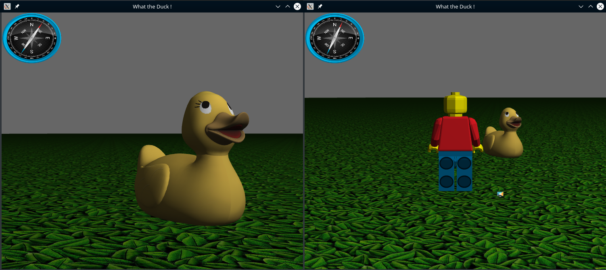

# WTD

## Install

FEDORA : `sudo dnf install gcc-c++ glew-devel glfw-devel SDL2-devel SDL2_image-devel openal-soft-devel freealut-devel freeglut-devel libjsoncpp-devel`

DEBIAN : `sudo apt install g++ mesa-utils libglew-dev libglfw3-dev libsdl2-dev libsdl2-image-dev libopenal-dev libalut-dev freeglut3-dev libjsoncpp-dev`


## How to use

> This is a two part project :

### Client

* Build : `make main`
* Run : `make run`

> __Tips__ : Type 'p' to switch between *first-person* and *third-person* perpective !

### Server

* Build : `make build-serv`
* Run : `make run-serv`

### Commons

* Clean : `make clean`

## Configure server

> You just need to edit `server_config.json` file

Default `server_config.json`:
```json
{
    "name":"La marre (au canard)",
    "max_player": 3,
    "objects":
    [
        {"type":"duck", "position":{"x":-5,"y":0,"z":-10}, "direction":{"x":0,"y":0,"z":0}},
        {"type":"horse", "position":{"x":5,"y":1,"z":-10}, "direction":{"x":0,"y":90,"z":0}},
        {"type":"penguin", "position":{"x":10,"y":0,"z":-10}, "direction":{"x":0,"y":0,"z":0}}
    ]
}
```

### Object types

* DUCK *(6640 polygons)*
* CAT *(35288 polygons)*
* HORSE *(6016 polygons)*
* LION *(64536 polygons)*
* PENGUIN *(5766 polygons)*
* MONKEY *(47488 polygons)*

## First-person and Third-person perspecive


